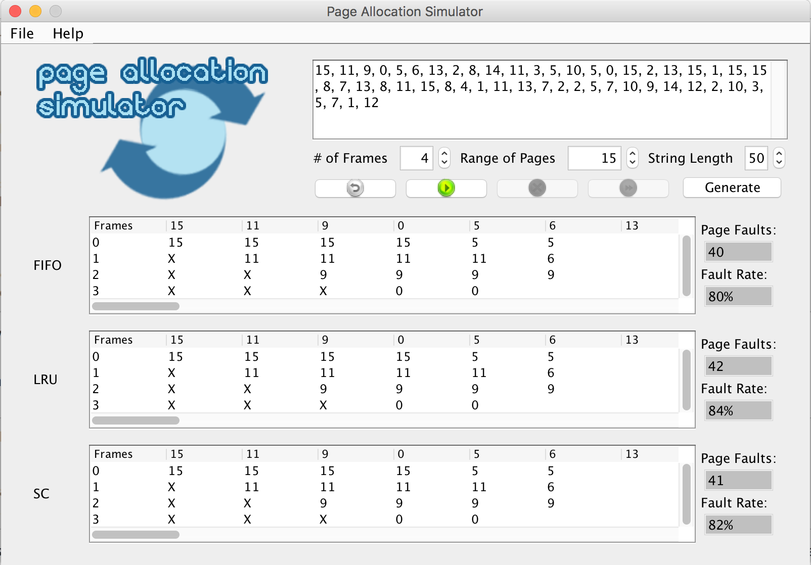

# Page Allocation Simulator
##### Current Version: 1.0

Page Allocation Simulator is a desktop application that simulates an operating systems various demand paging 
algorithms.

Current supported algorithms include:
* FIFO (First In First Out)
* LRU (Least Recently Used)
* SC (Second Chance)

